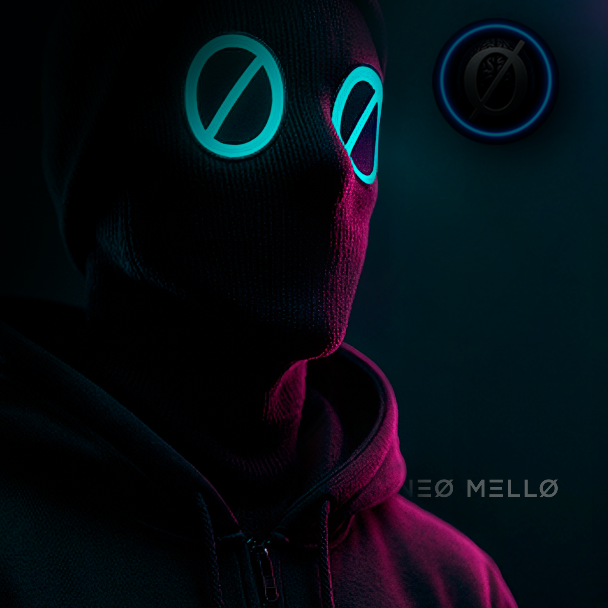

<div align="center">
  
  
  # NEØ MELLØ
  
  > Arquiteto de ecossistemas digitais • Estrategista digital • IA & Blockchain
  
  [](https://twitter.com/NeoProtoco77967)
  [](https://www.instagram.com/neoprotocol.eth/)
  [](https://etherscan.io/)
</div>

## ⚡ Manifesto

MELLØ, arquiteto de ecossistemas digitais e estrategista em descentralização, IA e blockchain. Não sigo tendências, eu as antecipo. Transformei a lógica das agências em ecossistemas vivos que pensam, aprendem e criam valor contínuo.

> Onde o mercado vê campanhas, eu vejo sistemas.  
> Onde buscam audiência, construo lealdade e conexão com nodes em DAOs.

Minha missão é a propagação da auto custódia. Minha moeda é o valor moral. Meu método é direto, guiado por visão, ruptura e síntese brutalmente honesta.

## Arquitetura Cognitiva
%%{init: {‘theme’:‘dark’, ‘themeVariables’: { ‘primaryColor’:’#1a3a5f’,‘primaryTextColor’:’#fff’,‘primaryBorderColor’:’#4FC3F7’,‘lineColor’:’#4FC3F7’,‘secondaryColor’:’#26C6DA’,‘tertiaryColor’:’#EC407A’,‘noteBkgColor’:’#1a1a1a’,‘noteTextColor’:’#fff’,‘noteBorderColor’:’#9575CD’}}}%%

flowchart TB
Start((Início))
Proc[Processamento]
Analise{Análise}
Nucleo((Núcleo Neural))
Metadata[/Metadata de Nodes/]
Interfaces[/Interfaces Experimentais/]
Proof[/Proof of Intent/]
Gestao[Gestão de MCP / ASI]
Mente((Mente Criativa Autônoma))

```
Start -.-> Proc
Proc --> Analise
Analise -.-> Nucleo

Nucleo -.-> Metadata
Nucleo -.-> Interfaces
Nucleo -.-> Proof

Metadata -.-> Gestao
Interfaces -.-> Gestao
Proof -.-> Gestao

Gestao -.-> Mente
Proof -.-> Mente

classDef blueNode fill:#1E3A5F,stroke:#4FC3F7,stroke-width:3px,color:#fff
classDef cyanNode fill:#0D3B4D,stroke:#26C6DA,stroke-width:3px,color:#fff
classDef magentaNode fill:#4D1E3A,stroke:#EC407A,stroke-width:3px,color:#fff
classDef purpleNode fill:#2D1E4D,stroke:#9575CD,stroke-width:3px,color:#fff
classDef coreNode fill:#0D1F3C,stroke:#4FC3F7,stroke-width:4px,color:#fff,stroke-dasharray: 8 6

class Start,Proc,Analise blueNode
class Interfaces,Gestao cyanNode
class Proof magentaNode
class Metadata,Mente purpleNode
class Nucleo coreNode
```

## 🌐 Ecossistemas & Tecnologias

<div align="center">
  
  
  
  
  
  
</div>

## Princípios de Arquitetura

1. **Arquitetura orientada a sistemas**  
   Projetos são concebidos como sistemas interdependentes, não como iniciativas isoladas.

2. **Descentralização como premissa**  
   Sempre que possível, controle, decisão e valor devem ser distribuídos entre os participantes do sistema.

3. **Auto custódia por padrão**  
   Usuários mantêm controle sobre ativos, identidades e permissões, evitando dependência de intermediários.

4. **Inteligência incorporada**  
   Sistemas devem conter mecanismos de aprendizado, adaptação e automação estratégica.

5. **Incentivos alinhados**  
   Modelos econômicos são desenhados para recompensar comportamentos que fortalecem o ecossistema.

6. **Valor contínuo acima de exposição**  
   Sustentabilidade e utilidade têm prioridade sobre métricas de curto prazo ou visibilidade artificial.

7. **Interoperabilidade e composição**  
   Componentes devem ser modulares, integráveis e reutilizáveis em diferentes contextos.

8. **Resiliência operacional**  
   Falhas são tratadas como eventos esperados. Sistemas devem continuar operando sob degradação parcial.

9. **Transparência verificável**  
   Processos críticos devem ser auditáveis, rastreáveis e verificáveis por participantes externos.

10. **Evolução incremental**  
    Mudanças são introduzidas de forma progressiva, preservando compatibilidade e estabilidade do sistema.
## 📊 Métricas & Evolução


## Áreas em Desenvolvimento
	
  •	Ecossistemas Digitais
Arquitetura de sistemas descentralizados orientados à evolução contínua e resiliência operacional.
	•	Inteligência Artificial
Implementação de agentes cognitivos para automação estratégica, coordenação e suporte à decisão.
	•	Tokenização
Estruturação de modelos econômicos digitais baseados em utilidade, incentivos alinhados e sustentabilidade de longo prazo.
	•	Web3 Marketing
Engenharia de mecanismos de engajamento para ambientes descentralizados e infraestruturas permissionless.

## Conexão

Modelos Convencionais
Abordagem NEØ
Campanhas
Sistemas Autônomos
Audiência
Nodes Coordenados
Tendências
Análise Antecipada
Marketing
Arquitetura de Ecossistemas
Centralização
Auto Custódia

Diretriz Operacional

Projetos são concebidos como sistemas adaptativos.
O objetivo primário é a continuidade de valor, não a maximização de exposição.

Estruturas são desenhadas para aprender, ajustar incentivos e manter operação consistente ao longo do tempo.


---

<div align="center">
  <i>"Expandir até o silêncio virar estrutura."</i>
</div>

