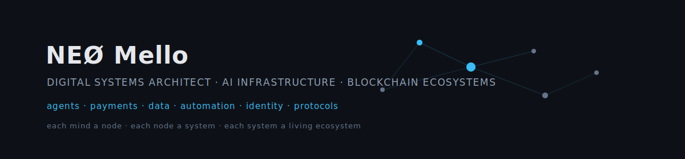

<picture>
  <source media="(prefers-color-scheme: dark)" srcset="./assets/neo-banner-dark.svg">
  <source media="(prefers-color-scheme: light)" srcset="./assets/neo-banner-light.svg">
  
</picture>

<div align="center">

**Digital Systems Architect · AI Infrastructure · Blockchain Ecosystems**

`agents · payments · data · automation · identity · protocols`

</div>

---

```bash
+--------------------------------------------------+
| SYSTEMS I BUILD                                  |
+--------------------------------------------------+
| 01 | AI agents for sales, support and operations |
| 02 | CRM + SDR + growth automation engines       |
| 03 | Payment layers connected to business events |
| 04 | Dashboards and operational interfaces       |
| 05 | Webhooks, APIs and agent runtimes           |
| 06 | Smart contract and token infrastructure     |
| 07 | Digital ecosystems with functional nodes    |
+--------------------------------------------------+
```

---
<div align="center">

[](https://x.com/node_mello)
[](https://www.instagram.com/neoprotocol.eth/)
[](https://etherscan.io/enslookup-search?search=neomello.eth)
[](https://neoprotocol.space)

<br><br>


</div>
