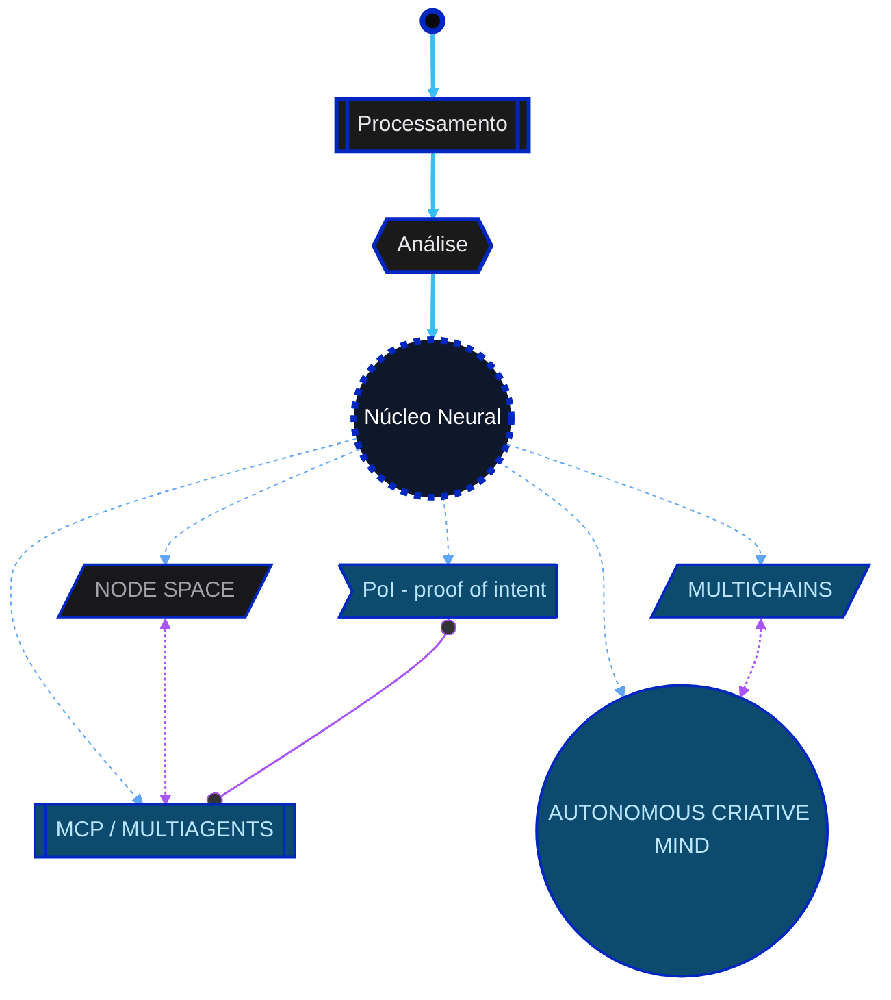

<div align="center">
  
  ► EACH MIND A NODE. EACH NODE, A UNIVERSE. ◄

</div>

<div align="center">
  
```
  ___ ___ ___  _____   _____ _____ ___ __  __ ___ 
 | __/ __/ _ \/ __\ \ / / __|_   _| __|  \/  / __|
 | _| (_| (_) \__ \\ V /\__ \ | | | _|| |\/| \__ \
 |___\___\___/|___/ |_| |___/ |_| |___|_|  |_|___/

```

</div>

<div align="center">

| `// ORG_NODE` | `// CORE_ARCHITECTURE` | `// SYS_STATUS` |
| --- | --- | --- |
| `[+]` **[NΞØ Protocol](https://github.com/NEO-PROTOCOL)** | APIs - Identity & Node Conect | `[██████████] 100%` |
| `[+]` **[NEO Smart Factory](https://github.com/neo-smart-factory)** | Smart Contracts & NSF Token | `[█████████░]  90%` |
| `[+]` **[NEO FlowOFF](https://github.com/NEO-FlowOFF)** | Agents - WebApp - Game & Dashboards | `[████████░░]  80%` |
| `[+]` **[FlowPay Core](https://github.com/FlowPay-Core)** | PIX-BRA ⬌ Web3 Cripto Bridge | `[█████████░]  90%` |
| `[-]` **[FluxxDAO](https://github.com/FluxxDAO)** | Governance & DAO | `[███░░░░░░░]  30%` |

</div>


---

<div align="center">

</div>


```mermaid
flowchart TB
    X(( )):::root
    M[[Processamento]]:::spine
    K{{Análise}}:::spine
    N((Núcleo Neural)):::core

    N1[/NODE SPACE/]:::gray
    N2[/MULTICHAINS/]:::blue
    N3>PoI - proof of intent]:::blue
    N4[[ MCP / MULTIAGENTS]]:::blue
    N5((AUTONOMOUS CRIATIVE MIND)):::blue

    X ==> M
    M ==> K
    K ==> N

    N -.-> N1
    N -.-> N2
    N -.-> N3
    N -.-> N4
    N -.-> N5

    N1 <-.-> N4
    N2 <-.-> N5
    N3 o--o N4

    classDef root fill:#0a0a0a,stroke:#0028c1,stroke-width:4px,color:#fff
    classDef spine fill:#1a1a1a,stroke:#0028c1,stroke-width:3px,color:#e5e7eb
    classDef core fill:#0f172a,stroke:#0028c1,stroke-width:5px,color:#fff,stroke-dasharray:5
    classDef gray fill:#18181b,stroke:#0028c1,stroke-width:2px,color:#a1a1aa
    classDef blue fill:#0c4a6e,stroke:#0028c1,stroke-width:2px,color:#bae6fd
    classDef pink fill:#0028c1,stroke:#0028c1,stroke-width:2px,color:#fbcfe8

    linkStyle 0,1,2 stroke:#38bdf8,stroke-width:3px
    linkStyle 3,4,5,6,7 stroke:#60a5fa,stroke-width:1px,stroke-dasharray:3
    linkStyle 8,9,10 stroke:#a855f7,stroke-width:1.5px
```


<div align="center">

## Activity

[](https://github.com/neomello)


</div>

---

<div align="center">
  <a href="https://github.com/neomello">
    
  </a>
</div>


---

<div align="center">
  
**Digital systems architecture · AI & Blockchain · Decentralized ecosystems**

[](https://x.com/node_mello)
[](https://www.instagram.com/neoprotocol.eth/)
[](mailto:neo@neoprotocol.space)
[](https://etherscan.io/enslookup-search?search=neomello.eth)
[](https://neoprotocol.space)

</div>

