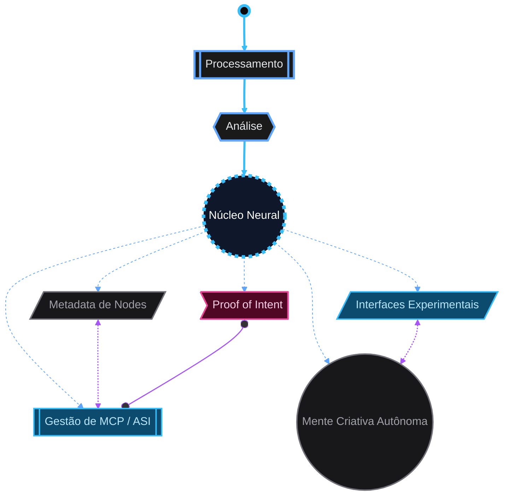

<div align="center">

```
███╗   ██╗███████╗ ██████╗     ███╗   ███╗███████╗██╗     ██╗      ██████╗
████╗  ██║██╔════╝██╔═══██╗    ████╗ ████║██╔════╝██║     ██║     ██╔═══██╗
██╔██╗ ██║█████╗  ██║   ██║    ██╔████╔██║█████╗  ██║     ██║     ██║   ██║
██║╚██╗██║██╔══╝  ██║   ██║    ██║╚██╔╝██║██╔══╝  ██║     ██║     ██║   ██║
██║ ╚████║███████╗╚██████╔╝    ██║ ╚═╝ ██║███████╗███████╗███████╗╚██████╔╝
╚═╝  ╚═══╝╚══════╝ ╚═════╝     ╚═╝     ╚═╝╚══════╝╚══════╝╚══════╝ ╚═════╝
```

**Digital systems architecture · AI & Blockchain · Decentralized ecosystems**

[](https://x.com/node_mello)
[](https://www.instagram.com/neoprotocol.eth/)
[](mailto:neo@neoprotocol.space)
[](https://etherscan.io/enslookup-search?search=neomello.eth)
[](https://neoprotocol.space)

</div>

---

<div align="center">

## Ecosystems

</div>

<div align="center">

| Org | Focus | Status |
|-----|-------|--------|
| [**NΞØ Protocol**](https://github.com/NEO-PROTOCOL) | Identity, reputation & node onboarding on-chain | 🟢 Active |
| [**NEO Smart Factory**](https://github.com/neo-smart-factory) | Smart contract infrastructure · NSF Token · FlowPay | 🟢 Active |
| [**NEO FlowOFF**](https://github.com/NEO-FlowOFF) | Token, PWA & content automation layer | 🟢 Active |
| [**FlowPay Core**](https://github.com/FlowPay-Core) | PIX-native payment rails · Web3 bridge | 🟢 Active |
| [**FluxxDAO**](https://github.com/FluxxDAO) | DAO governance & liquidity coordination | 🔵 Building |

</div>

---

<div align="center">

## Operational Scope

</div>

<div align="center">

| **What I Build** | **How I Think** |
|------------------|-----------------|
| Production-grade digital systems architecture | Systems before features |
| Coordination of multidisciplinary teams (engineering, product, growth) | Documentation as infrastructure |
| Infrastructure for decentralized ecosystems | Small teams, high leverage |
| Strategic automation and cognitive agents | Autonomy over micromanagement |
| Technical and economic governance of platforms | Long-term value over short-term metrics |

</div>

---

<div align="center">

## Cognitive Architecture

</div>


```mermaid
flowchart TB
    X(( )):::root
    M[[Processamento]]:::spine
    K{{Análise}}:::spine
    N((Núcleo Neural)):::core

    N1[/Metadata de Nodes/]:::gray
    N2[/Interfaces Experimentais/]:::blue
    N3>Proof of Intent]:::pink
    N4[[Gestão de MCP / ASI]]:::blue
    N5((Mente Criativa Autônoma)):::gray

    X ==> M
    M ==> K
    K ==> N

    N -.-> N1
    N -.-> N2
    N -.-> N3
    N -.-> N4
    N -.-> N5

    N1 <-.-> N4
    N2 <-.-> N5
    N3 o--o N4

    classDef root fill:#0a0a0a,stroke:#38bdf8,stroke-width:4px,color:#fff
    classDef spine fill:#1a1a1a,stroke:#60a5fa,stroke-width:3px,color:#e5e7eb
    classDef core fill:#0f172a,stroke:#38bdf8,stroke-width:5px,color:#fff,stroke-dasharray:5
    classDef gray fill:#18181b,stroke:#71717a,stroke-width:2px,color:#a1a1aa
    classDef blue fill:#0c4a6e,stroke:#38bdf8,stroke-width:2px,color:#bae6fd
    classDef pink fill:#500724,stroke:#ec4899,stroke-width:2px,color:#fbcfe8

    linkStyle 0,1,2 stroke:#38bdf8,stroke-width:3px
    linkStyle 3,4,5,6,7 stroke:#60a5fa,stroke-width:1px,stroke-dasharray:3
    linkStyle 8,9,10 stroke:#a855f7,stroke-width:1.5px
```

---

<div align="center">

## Stack


</div>

---

<div align="center">

## Activity

[](https://github.com/neomello)

[](https://github.com/neomello)

</div>

---


▓▓▓ NΞØ MELLØ
────────────────────────────────────────
Core Architect · NΞØ Protocol
neo@neoprotocol.space

"Code is law. Expand until
silence becomes structure."
────────────────────────────────────────
```
 █████ █         
██╔═══██╗       
██║ █ ██║  
██ █  ██║      
╚██████╔╝   
█ ╚═══╝     

```

</div>
