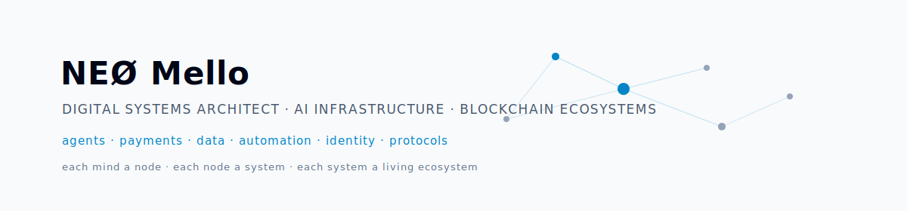
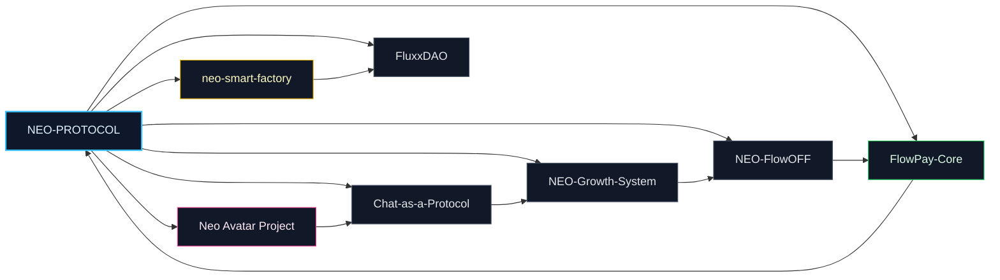

# CRIATIVE MIND

<div align="center">
  
</div>

<div align="center">

# NEØ Mello

**Digital Systems Architect · AI Infrastructure · Blockchain Ecosystems**

`agents · payments · data · automation · identity · protocols`


---

## ◧ Current Focus

Building a distributed ecosystem where **AI agents, payment events, CRM flows, dashboards, webhooks and on-chain infrastructure** operate as connected systems.

Not isolated tools.  
Not content layers.  
Infrastructure.

---

## ░ Ecosystem Nodes

| Node | Layer |
| --- | --- |
| [NEO-PROTOCOL](https://github.com/NEO-PROTOCOL) | protocol core |
| [NEO-FlowOFF](https://github.com/NEO-FlowOFF) | business systems |
| [NEO-Growth-System](https://github.com/NEO-Growth-System) | CRM · SDR · growth automation |
| [Chat-as-a-Protocol](https://github.com/Chat-as-a-Protocol) | agent runtime |
| [FlowPay-Core](https://github.com/FlowPay-Core) | financial events |
| [flowpay-system](https://github.com/flowpay-system) | payment infrastructure |
| [neo-smart-factory](https://github.com/neo-smart-factory) | smart contract factory |
| [FluxxDAO](https://github.com/FluxxDAO) | governance |
| Neo Avatar Project | synthetic identity |

---

## ◨ Protocol Map


```mermaid
flowchart LR
    P[NEO-PROTOCOL] --> C[Chat-as-a-Protocol]
    P --> F[NEO-FlowOFF]
    P --> G[NEO-Growth-System]
    P --> FP[FlowPay-Core]
    P --> S[neo-smart-factory]
    P --> D[FluxxDAO]
    P --> A[Neo Avatar Project]

    C --> G
    G --> F
    F --> FP
    FP --> P
    S --> D
    A --> C

    classDef core fill:#0f172a,stroke:#38bdf8,stroke-width:2px,color:#e0f2fe;
    classDef node fill:#111827,stroke:#475569,stroke-width:1px,color:#e5e7eb;
    classDef payment fill:#111827,stroke:#22c55e,stroke-width:1px,color:#dcfce7;
    classDef identity fill:#111827,stroke:#ec4899,stroke-width:1px,color:#fce7f3;
    classDef chain fill:#111827,stroke:#eab308,stroke-width:1px,color:#fef9c3;

    class P core;
    class C,F,G,D node;
    class FP payment;
    class S chain;
    class A identity;
```

---

<details>
<summary>░ What I Build</summary>

<br>

```txt
+--------------------------------------------------+
| SYSTEMS I BUILD                                  |
+--------------------------------------------------+
| 01 | AI agents for sales, support and operations |
| 02 | CRM + SDR + growth automation engines       |
| 03 | Payment layers connected to business events |
| 04 | Dashboards and operational interfaces       |
| 05 | Webhooks, APIs and agent runtimes           |
| 06 | Smart contract and token infrastructure     |
| 07 | Digital ecosystems with functional nodes    |
+--------------------------------------------------+
```

</details>

---

<details>
<summary>◨ Stack Signals</summary>

<br>

```txt
NEO_PROTOCOL
|
+-- runtime
|   +-- agents
|   +-- APIs
|   +-- orchestration
|   +-- memory
|
+-- growth
|   +-- CRM
|   +-- SDR
|   +-- automation
|   +-- dashboards
|
+-- payments
|   +-- PIX
|   +-- ledger
|   +-- webhooks
|   +-- business events
|
+-- chain
|   +-- smart contracts
|   +-- tokens
|   +-- governance
|
+-- interfaces
    +-- webapps
    +-- chat
    +-- avatars
    +-- operational UI
```

</details>

---

<details>
<summary>◧ Origin</summary>

<br>

I spent more than a year and a half studying in silence.

Learning new technologies.  
Rebuilding marketing systems.  
Testing agents, APIs, dashboards, payment flows, CRM structures, apps, automations and infrastructure.

At some point, I stopped planning too much.

And started building.

One system per day.

What looked like isolated repositories became a distributed architecture.

Not projects.  
Nodes.

Not tools.  
Systems.

Not content.  
Infrastructure.

</details>

---

<div align="center">

## ░ Connect

[](https://x.com/node_mello)
[](https://www.instagram.com/neoprotocol.eth/)
[](https://etherscan.io/enslookup-search?search=neomello.eth)
[](https://neoprotocol.space)

<br><br>

↳ © NΞØ PROTOCOL  
↳ neoprotocol.space

</div>
